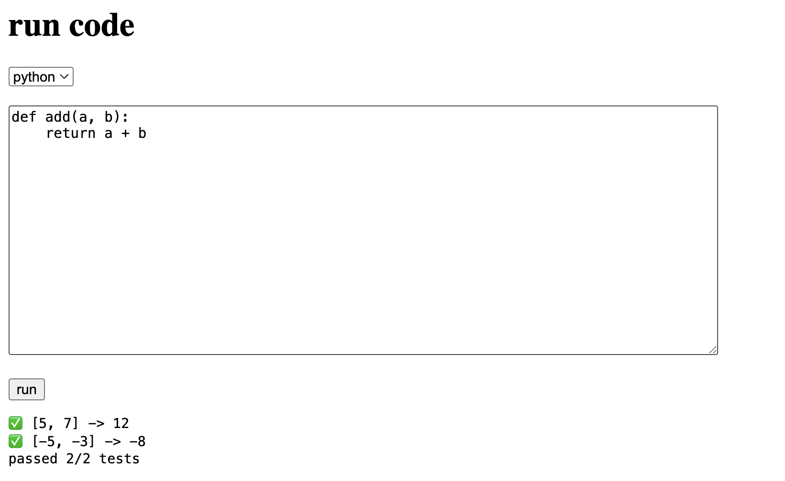
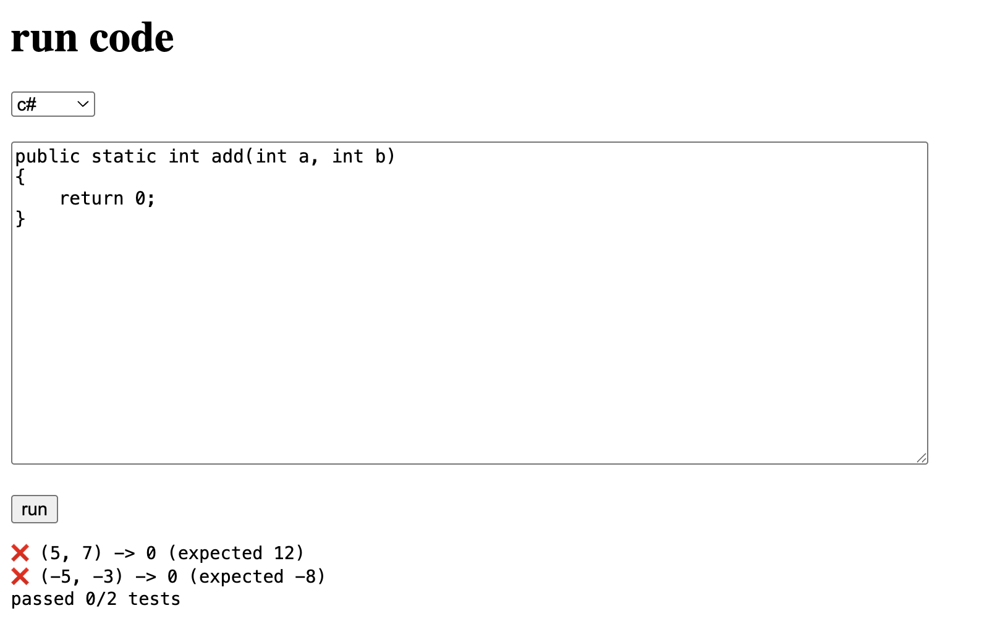

# Code Runner

A simple web-based code runner supporting **Python** and **C#** using Docker, built with **Fastify** for the API and modern frontend technologies.

## Features

* Run Python and C# functions directly from the browser
* Automated test cases
* Human-readable pass/fail output
* Safe execution inside Docker containers
* Built with **Fastify** for fast, lightweight API handling
* Interactive frontend with language-specific templates

## Tools & Technologies

* **Node.js** and **Fastify** for the backend API
* **Docker** for safe code execution and sandboxing
* **TypeScript** for type-safe backend code
* **HTML/JS** for a simple, interactive frontend
* Optional: **React** or other frontend frameworks for future improvements

## Requirements

* Docker installed
* Node.js >= 20
* npm or yarn

## Installation

```bash
git clone https://github.com/VulcanWM/code-runner.git
cd code-runner
npm install
```

## Running the Server

```bash
npm start
# The server will run on http://[::1]:8080
```

## Usage

1. Open `http://[::1]:8080` in your browser
2. Select the language (Python or C#) from the dropdown
3. Type your function code in the editor
4. Click **Run** to see the test results

### Tips

* Switching languages updates the editor with language-specific templates
* Test results are shown immediately in the browser
* Custom test cases can be added in the backend `/run` route

## Screenshots

### Python - Correct Output


### C# - Wrong Output



## Adding New Languages

1. Add a new language branch in the `/run` route of the server
2. Create a Docker environment and test runner for the new language
3. Update the frontend dropdown and templates accordingly

## Contributing

Contributions are welcome! If you want to help improve the Code Runner, here are some ways you can contribute:

### Adding a New Language

1. Fork the repository and create a new branch for your language.
2. Update the `/run` endpoint in the backend:

   * Add a new case for your language in the request handler.
   * Implement a Docker-based test runner for safe execution.
   * Define default test cases and output formatting.
3. Update the frontend:

   * Add your language to the dropdown menu.
   * Add a default code template for your language in the editor.
4. Test your changes locally using `npm start`.
5. Submit a pull request with a clear description of the added language and any instructions for running it.

### Bug Reports & Feature Requests

* Use the **Issues** tab to report bugs or request new features.
* Include steps to reproduce the issue or describe the feature clearly.

### Guidelines

* Keep code style consistent with the existing TypeScript backend and JavaScript frontend.
* Ensure Docker execution is safe and isolated.
* Write clear commit messages describing your changes.

## License

This project is licensed under the MIT License. See the [LICENSE](LICENSE) file for details.
